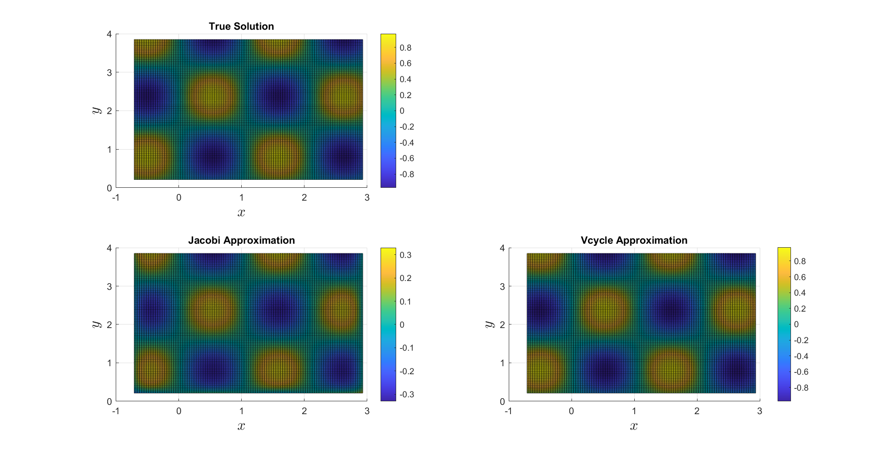
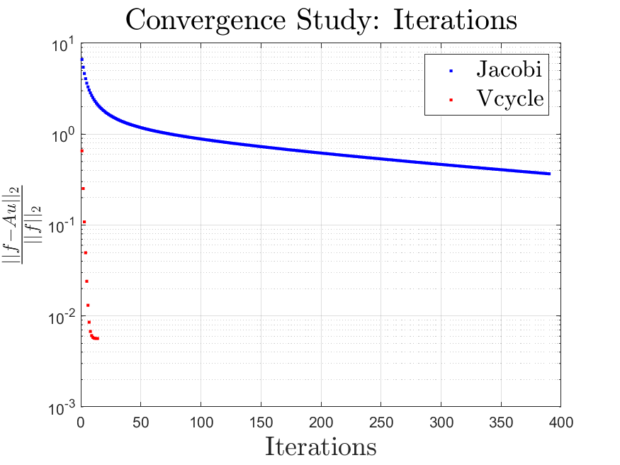
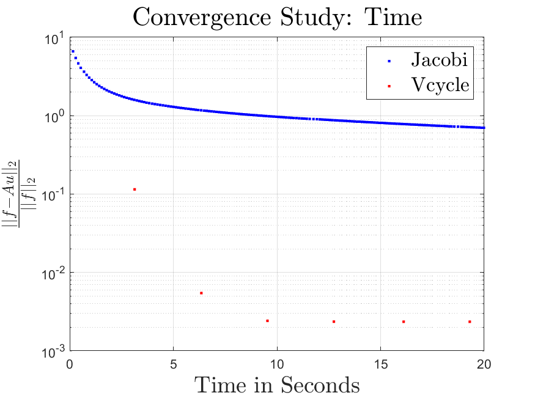
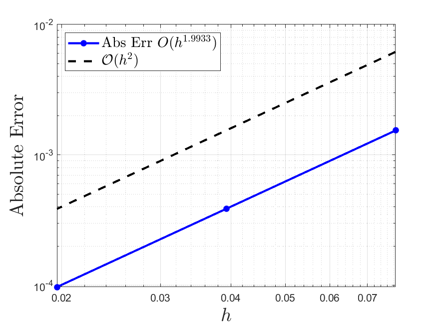
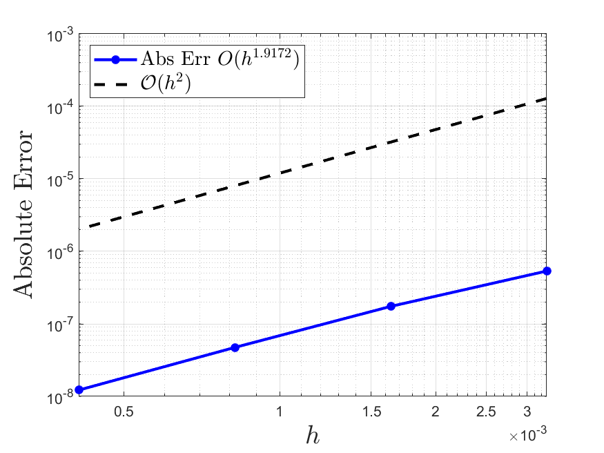

# A Multi-Grid Poisson Solver
This project contains a Matlab implementation of a V-cycle multi-grid solver and a baseline Jacobi solver. It solves the Poisson problem on the form
```math
\Delta u = f
```
There are Dirichlet boundary condidions imposed on horizontal boundaries and Neumann conditions imposed on vertical boundaries. It is assumed that the number of cells in each dimension is even, or equivalently that the number of lattices is odd.

## Test Problem
We may consider some trigonometric function
```math
u(x,y,x) = \sin(k_x x)\sin(k_y y)\sin(k_z z)
```
for which it is easy to derive the analytic Laplcian
```math
f = \Delta u = -(kx^2+ky^2+kz^2)u(x,y,x)
```
A slice of the domain has been plotted for simplicity.
<p align="center">
  
</p>

## Convergence Study
It can be seen that the Vcycle converges in much fewer iterations than the Jacobi solver.
<p align="center">
  
</p>
However, one V-cycle takes significantly longer than a Jacobi iteration. Therefore, it is more fair to compare the normalized residual per time.
<p align="center">
  
</p>
In conclusion, the V-cycle does outperform the Jacobi method when measuring convergence per time which was also expected.

## Verifying the Order of Accuracy
From theory the scheme should be second order convergent, that is halving should result in a four times smaller maximal error. For the exact solver on the coarsest grid the empirical convergence is given in the following figure.
<p align="center">
  
</p>
For the whole multigrid algorithm the results are given by the following figure. The order is not exactly two so there might be an error in the implementation. Or perhaps it will be second order convergent for smaller grid spacings.
<p align="center">
  
</p>