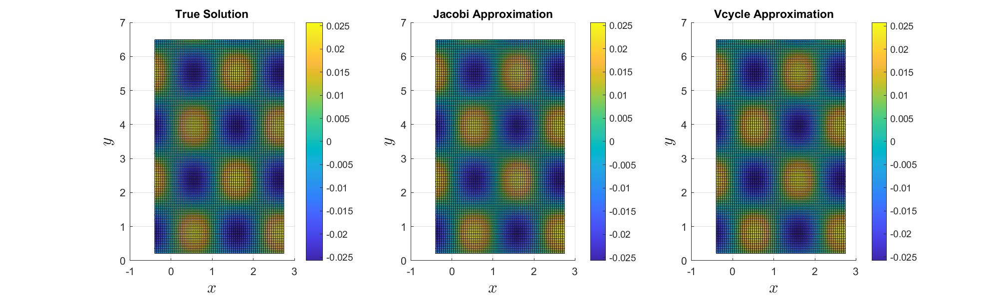
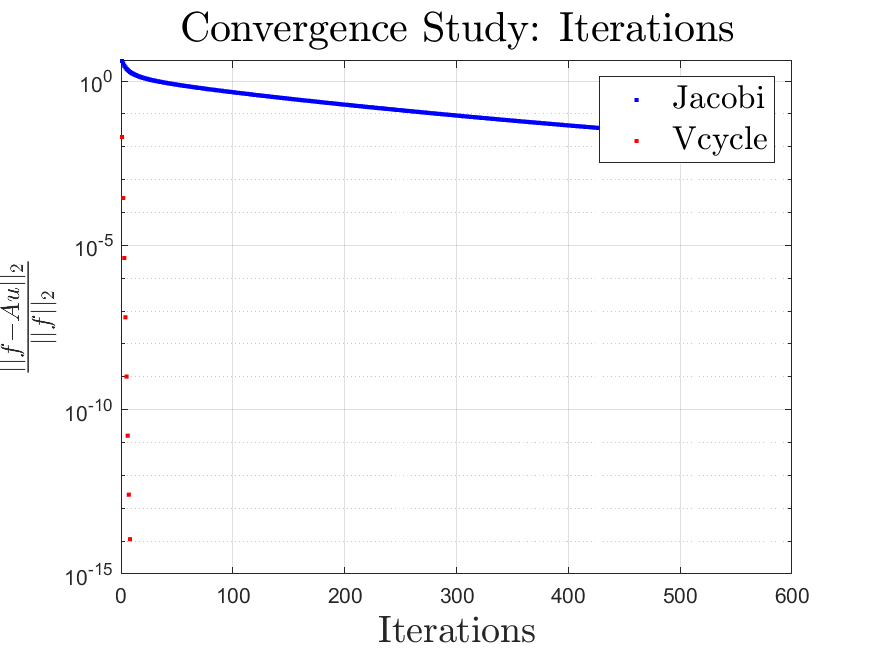
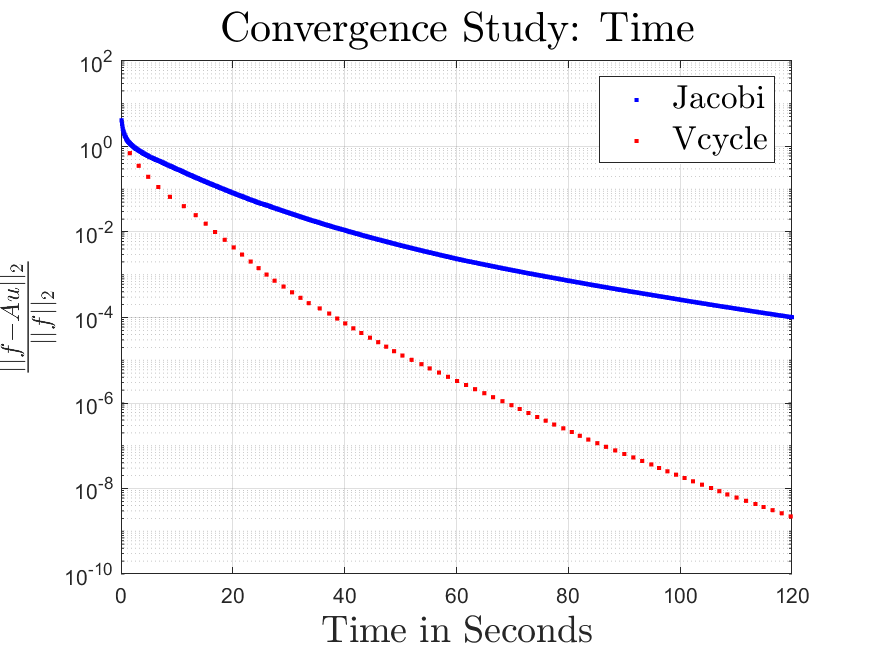

# A Multi-Grid Poisson Solver
This project contains a Matlab implementation of a V-cycle multi-grid solver and a baseline Jacobi solver. It solves the Poisson problem on the form
$$
\Delta u = f
$$
The setup is a bit simplified:
- The solver only works for cubic, equidistant domains.
- There are Dirichlet boundary considions on all surfaces.

## Test Problem
We may consider some trigonometric function
$$
u(x,y,x) = \sin(k_x x)\sin(k_y y)\sin(k_z z)
$$
for which it is easy to derive the analytic Laplcian
$$
f = \Delta u = -(kx^2+ky^2+kz^2)u(x,y,x)
$$
A slice of the domain has been plotted for simplicity.

  

## Convergence Study
It can be seen that the Vcycle converges in much fewer iterations than the Jacobi solver.

  

However, one V-cycle takes significantly longer than a Jacobi iteration. Therefore, it is more fair to compare the normalized residual per time.

  

In conclusion, the V-cycle does outperform the Jacobi method when measuring convergence per time which was also expected.