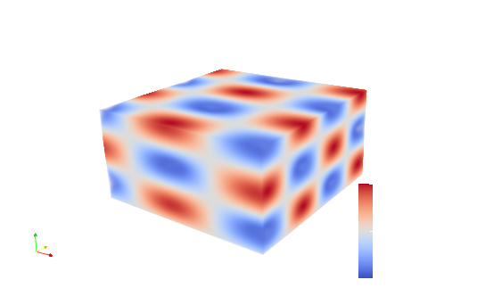
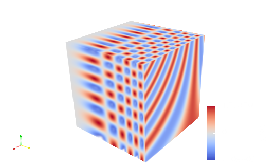
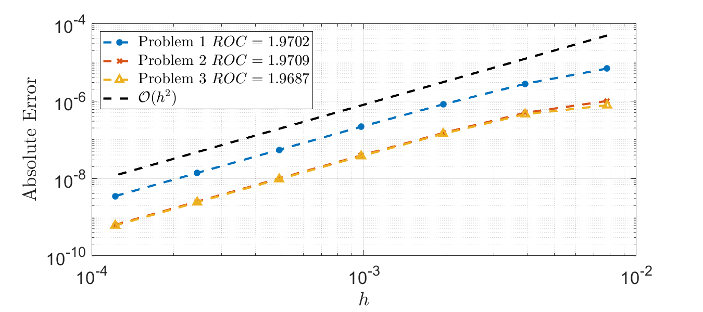

# Multigrid Methods for the Poisson Equation
This project contains a framework for finite difference multigrid methods. The header files in `include` contain class templates for a number of functionalities, the `src` directory contains the source files, and the `drivers` directory contains examples of how to use the solvers.

## Compilation
The folder `config/` contains a number of makefiles that set compiler flags, preprocessor flags, etc. for OpenMP target offloading in `clang++`, `g++`, and `nvc++` and flags specific to some common GPU architectures. Note that some version of `nvc++` from the NVIDIA HPC-SDK are not yet compatible with the project.<br><br>
To compile one of the examples, you may type
```bash
export COMPILER=<g++,clang++,nvc++>
export GPU=<V100,A100>
make APP=<multigrid,minimal_multigrid,minimal_jacobi,minimal_gauss_seidel>
```
and an example can for instance be executed with
```bash
./drivers/minimal_multigrid -x 513 -y 257 -z 129 -l 6 -maxiter 10
```
To compile only the archive, type
```bash
make archive
```
to make the archibe `libpoisson.a`. To use this archive in your project, compile with `-Iinlcude -Llib -lpoisson`.<br><br>
One can select between three test problems if one wants to use one of the drivers. The test problems can be selected by compiling with `PROBLEM=1`, `PROBLEM=2`, or, `PROBLEM=3`. 

## The Array Class and the Device Array Class
The most important class templates in this project are probably `array.h` and the derived template class `devicearray.h`. They contain functions for indexing 3D arrays that abstracts away the halos. Futher, they contain functionality for mapping arrays to GPUs and saving arrays with or without the halos. See for instance the following figure:

Saved With Halo            | Saved Without Halo
:-------------------------:|:-------------------------:
  | 

## Making a Solver
The `PoissonSolver` class is heavily templated. When a solver instance is created, it is given a floating-point type, a restiction type, a prolongation type, and a relaxation type, for example
```c++
#include "libpoisson.h"
Poison::PoissonSolver<
  Poisson::double_t,
  Poisson::Injection,
  Poisson::TrilinearInterpolation,
  Poisson::GaussSeidel> solver(settings);
```
To initialize all the arrays in the solver to zero, use
```c++
solver.init_zero();
```
Before using the solver to solve the problem, the right-hand side and boundary conditions must be transferred to the device. This can be done with
```c++
solver.to_device();
```
One can either use a relaxation scheme as the solver
```c++
solver.solve("relaxation");
```
or a V-cycle with
```c++
solver.solve("Vcycle");
```
Finally, the result can be mapped back to the host with
```c++
solver.to_host();
```

## Currently Supported Multigrid Components
The framework supports a number of different relaxation schemes and restriction and prolongation operators.
- Relaxation: `Poisson::Relaxation`
  - Jacobi relaxation: `Poisson::Jacobi`
  - Red-black Gauss-Seidel successive overrelaxation: `Poisson::GaussSeidel`
- Restriction operator: `Poisson::Restriction`
  - Injection: `Poisson::Injection`
  - Full weighting: `Poisson::FullWeighting`
- Prolongation operator: `Poisson::Prolongation`
  - Trilinear interpolation: `Poisson::TrilinearInterpolation`
- Boundary condition: `Poisson::Boundary`
  - Dirichlet condition: `Poisson::Dirichlet`
  - Neumann condition: `Poisson::Neumann`


## Test Problems
To generate a number of test problems, we may consider some function $u$ and find the Laplacian $f=\Delta u$ and the first order derivatives at the boundaries $\frac{\partial u}{\partial x}$ and $\frac{\partial u}{\partial y}$
### Test Problem I
We may consider some trigonometric function
```math
u(x,y,x) = \sin(k_x x)\sin(k_y y)\sin(k_z z)
```
for which it is easy to derive the analytic Laplacian
```math
f = \Delta u = -(k_x^2+k_y^2+k_z^2)u(x,y,x)
```
and the Neumann boundary conditions are given by
```math
\frac{\partial u}{\partial x} = k_x\cos(k_xx)\sin(k_yy)\sin(k_zz)
```
```math
\frac{\partial u}{\partial y} = k_y\sin(k_xx)\cos(k_yy)\sin(k_zz).
```
True Solution              | Numerical Solution
:-------------------------:|:-------------------------:
  | 

### Test Problem II
The polynomial
```math
u(x,y,x) =  x^3y^2z
```
has the Laplacian
```math
f = \Delta u = 2x^3z + 6xy^2z.
```
The Neumann boundary conditions are given by
```math
\frac{\partial u}{\partial x} = 3x^2y^2z
```
```math
\frac{\partial u}{\partial y} = 2x^3yz
```
True Solution              | Numerical Solution
:-------------------------:|:-------------------------:
  | 

### Test Problem III
The trigonometric funtion
```math
u(x,y,x) = \cos(xz^2)\sin(y^3)
```
has the Laplacian
```math
f = \Delta u = ((-4x^2z^2 - 9y^4 - z^4)\sin(y^3) + 6y\cos(y^3))\cos(xz^2) - 2x\sin(xz^2)\sin(y^3).
```
The Neumann boundary conditions are given by
```math
\frac{\partial u}{\partial x} = -z^2\sin(xz^2)\sin(y^3)
```
```math
\frac{\partial u}{\partial y} = 3y^2\cos(xz^2)\cos(y^3)
```
True Solution              | Numerical Solution
:-------------------------:|:-------------------------:
  | 

## Verifying the Order of Accuracy
From theory, the scheme should be second order convergent. That means that halving the grid spacing should result in a four times smaller maximal absolute error. As it can be seen, the multigrid algorithm has the expected order of convergence for the three test problems. The files used to generate the convergence tests are `convergence.sh` and `plot_convergence.m`.
<p align="center">
  
</p>
